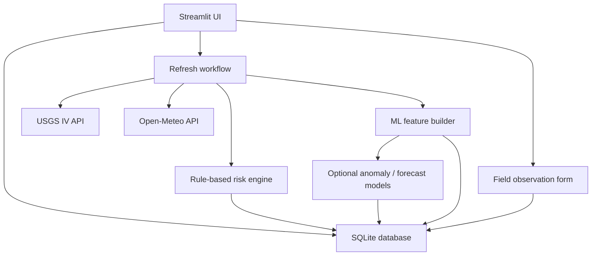

# Community Runoff Monitor

A community-facing Streamlit dashboard that tracks stormwater runoff risk across five U.S. urban waterways. It combines live USGS stream readings with Open-Meteo precipitation forecasts into a transparent, plain-language risk score — no API keys required to get started.

> **Disclaimer:** This tool is for educational and community awareness only. It does not determine whether water is safe to drink, swim in, or touch, and it is not a flood prediction system.

---

## Features

- **Live runoff risk scores** — transparent, rule-based scoring across four components: recent rainfall, stream/gage condition, turbidity proxy, and forecast precipitation
- **Five preloaded U.S. regions** — covers Sligo Creek MD, Waimanalo Stream HI, Peachtree Creek GA, Brays Bayou TX, and the LA River CA
- **Trends & history** — view cached historical snapshots and export data as CSV
- **Field observations** — submit and log on-the-ground notes per region
- **Methodology tab** — explains exactly how every score is calculated, including known data gaps
- **Research ML layer** — optional anomaly detection and supervised forecasting that activates once a region has enough history (never replaces the rule-based score)
- **No external accounts needed** — uses free public APIs (USGS WaterServices, Open-Meteo)

---

## Tech Stack

- **Python 3.11+** · **Streamlit** · **SQLite**
- **scikit-learn** (logistic regression, random forest, Isolation Forest)
- **USGS WaterServices IV API** · **Open-Meteo API**

---

## Getting Started

### Prerequisites

- Python 3.11 or newer
- Git

### Installation

**Windows (PowerShell):**

```bash
git clone https://github.com/your-username/community-runoff-monitor.git
cd community-runoff-monitor
python -m venv .venv
.venv\Scripts\activate
python -m pip install --upgrade pip
python -m pip install -r requirements.txt
copy .env.example .env
```

**macOS / Linux:**

```bash
git clone https://github.com/your-username/community-runoff-monitor.git
cd community-runoff-monitor
python3 -m venv .venv
source .venv/bin/activate
python -m pip install --upgrade pip
python -m pip install -r requirements.txt
cp .env.example .env
```

Open `.env` and set a local admin token:

```env
ADMIN_TOKEN=replace_me_with_a_local_secret
```

### Run

```bash
python scripts/ingest.py   # pull fresh data for all regions
streamlit run app.py       # launch the dashboard
```

Open the URL shown in the terminal. Use the sidebar to switch regions. The `ADMIN_TOKEN` unlocks data refresh controls in the sidebar.

---

## Supported Regions

| Region | USGS Site | Notes |
|---|---:|---|
| Sligo Creek — Takoma Park, MD | 01650800 | Default region |
| Waimanalo Stream — Oahu, HI | 16249000 | Tropical runoff with turbidity |
| Peachtree Creek — Atlanta, GA | 02336300 | Urban runoff focus |
| Brays Bayou — Houston, TX | 08075000 | Stormwater monitoring |
| Los Angeles River — Sepulveda Dam, CA | 11092450 | Water quality & sediment |

Region coordinates, timezones, map zoom levels, and station IDs are all defined in `src/config.py` and easy to extend.

---

## Refreshing Data

```bash
# All regions
python scripts/ingest.py

# One region
python scripts/ingest.py --region sligo-creek-md
```

Data can also be refreshed from the Streamlit sidebar when a valid admin token is entered.

---

## How the Risk Score Works

The risk score is built from four weighted components that sum to 100:

| Component | Weight |
|---|---|
| Recent rainfall | 40 |
| Stream / gage condition | 30 |
| Turbidity / water-quality proxy | 20 |
| Forecast precipitation | 10 |

The app only totals weights for components that have real data. If the available weight falls below 50, the result is shown as **Insufficient Data** instead of a misleading number.

**Risk categories:** `0–24` Low · `25–49` Elevated · `50–74` High · `75–100` Severe

Full scoring formulas and confidence logic are documented in the in-app **Methodology** tab.

---

## Machine Learning (Research Layer)

The ML layer is supplementary and never the primary risk signal. It activates automatically once a region has accumulated enough history:

- Anomaly detection: 100+ historical rows
- Supervised forecasting: 500+ aligned samples

Supported models: logistic regression, random forest, Isolation Forest anomaly scoring.

```bash
python scripts/build_features.py --region sligo-creek-md
python scripts/train_model.py --region sligo-creek-md --model-type random_forest
python scripts/backtest_model.py --region sligo-creek-md
```

Backtest output includes precision, recall, F1, ROC-AUC, and a confusion matrix.

---

## Running Tests

```bash
python -m pytest -q
```

All tests run against mocked payloads — no live API calls.

---

## Makefile

```bash
make install    # install dependencies
make run        # start the dashboard
make ingest     # fetch fresh data
make features   # build ML feature rows
make train      # train a model
make backtest   # run backtesting
make test       # run test suite
make lint       # lint the codebase
```

---

## Deployment

**Streamlit Community Cloud:**
1. Fork this repo and connect it to [share.streamlit.io](https://share.streamlit.io).
2. Set the entrypoint to `app.py`.
3. Add `ADMIN_TOKEN` under **Secrets**.

**Render:**
1. Create a new Python web service pointed at this repo.
2. Build command: `pip install -r requirements.txt`
3. Start command: `streamlit run app.py --server.port $PORT --server.address 0.0.0.0`
4. Add `ADMIN_TOKEN` under **Environment Variables**.

> SQLite is stored locally. For a persistent public deployment, mount a persistent disk or migrate to a hosted database.

---

## Architecture



---

## Data Sources

- **USGS WaterServices IV** — `https://waterservices.usgs.gov/nwis/iv/` *(no key required)*
- **Open-Meteo** — `https://api.open-meteo.com/v1/forecast` *(no key required)*

> USGS has announced the legacy WaterServices IV endpoint will be decommissioned in early 2027. A migration to `https://api.waterdata.usgs.gov` is on the roadmap.

---

## Known Limitations

| Region | Notes |
|---|---|
| Sligo Creek — Takoma Park, MD | Turbidity readings can be sparse or absent. |
| Waimanalo Stream — Oahu, HI | Usually provides live discharge, gage height, and turbidity readings. |
| Peachtree Creek — Atlanta, GA | Individual parameters can appear/disappear by station. |
| Brays Bayou — Houston, TX | Water-quality proxies may be limited. |
| Los Angeles River — Sepulveda Dam, CA | Not every requested stream parameter is always present. |

Other known limitations:
- Public APIs can return sparse or stale data without notice.
- Open-Meteo precipitation is a weather model estimate, not a site rain gauge.
- Local baselines are only as reliable as the data stored in SQLite.
- ML outputs are not official alerts.

---

## Roadmap

- [ ] Migrate USGS ingestion to the newer Water Data APIs
- [ ] Add exportable public reports and model cards
- [ ] Automated data quality checks
- [ ] Richer map layers for watershed context
- [ ] CSV export from Trends and ML Evaluation tabs
- [ ] Demo dataset mode

---

## Contributing

Pull requests are welcome. For major changes, please open an issue first to discuss what you'd like to change. Make sure tests pass before submitting a PR.

---

## License

[MIT](LICENSE)
